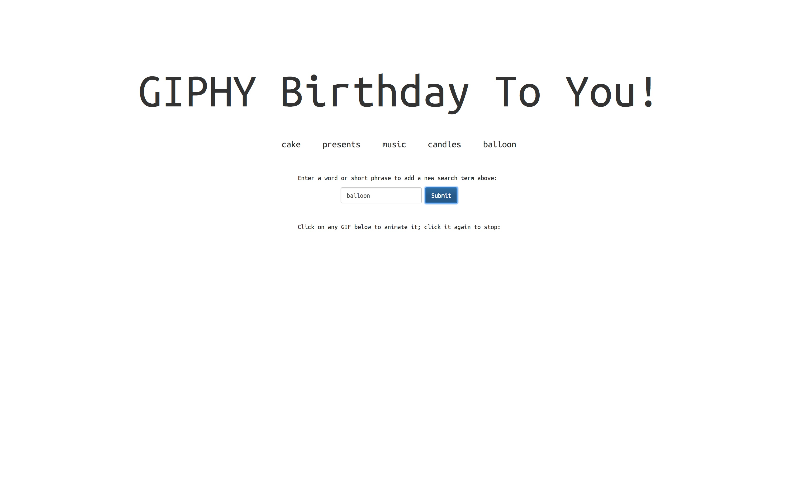
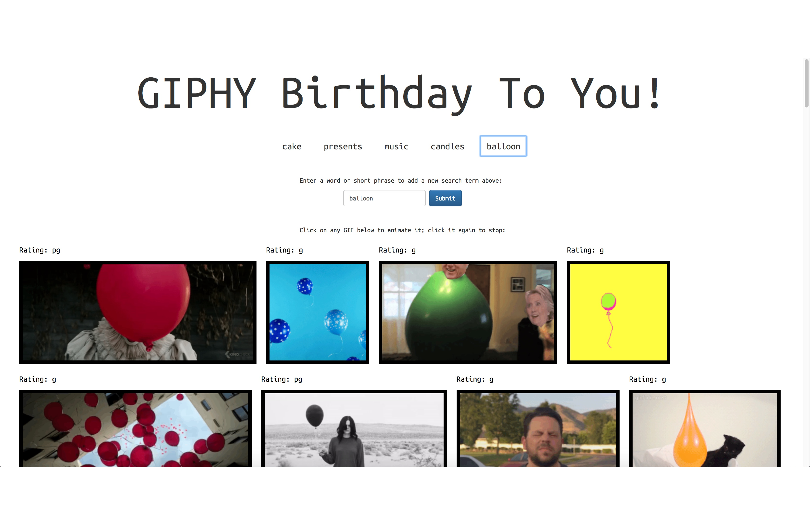

# Giphy Birthday

Ever forget to wish someone in your life a happy birthday? Fear not, for Giphy Birthday has you covered (at least in the card/recognition department).

This app implements the Giphy API. Display birthday-related gifs when you click on a button. Click any of the images and the gifs will animate. Enter your own search terms and hit Search to add it to the list.

## Getting Started
https://jmcenroe.github.io/Giphy/ 

## Screen Shot

Clicking on any button displays gifs relating to that theme

Input a new theme

When you click the new button that is created, gifs will appear below

## Technologies used
- Bootstrap
- jQuery
- Giphy API

