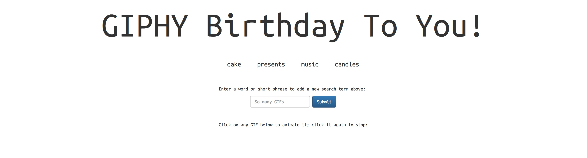

# Giphy Search

Implements the Giphy API. Displays birthday-related gifs when the button clicked. Hover your mouse over images and the gifs will animate. Enter your own search terms and hit Search to add it to the list.

## Getting Started
https://jmcenroe.github.io/Giphy/ 

## Screen Shot

Clicking on any button displays gifs relating to that theme

Input a new theme and when you click the new button that is created, gifs will appear below.

## Technologies used
- Bootstrap
- jQuery
- Giphy API

